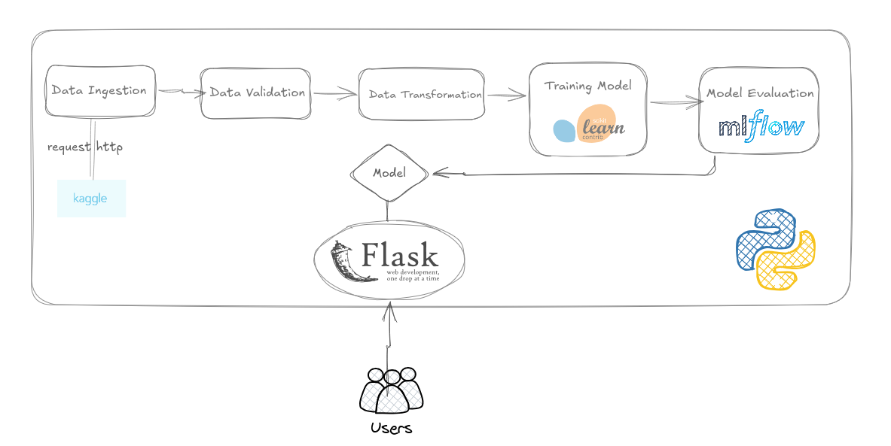

# wine-quality-mlops
This project predicts wine quality using machine learning. It features a full MLOps pipeline with data ingestion, validation, training, evaluation, and a Flask web app for user-friendly predictions.



## Run with Docker

1. Pull the image from Docker Hub:
```bash 
docker pull ymrassi/wine-quality
``` 

2. Run the container:

```bash 
docker run -p 8080:8080 ymrassi/wine-quality
``` 


3. Open your browser and go to [http://localhost:8080](http://localhost:8080) to access the app.